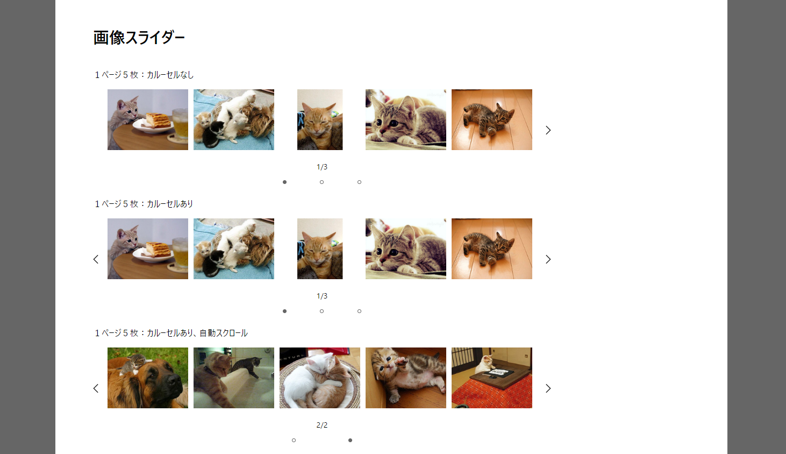

🌙 jquery-isystkSlider
====


## 📗 プロジェクトの概要

jQueryで作成した汎用画像スライダーです。

## 🌐 Demo

#### ■ フロント画面（React）

https://isystk.github.io/jquery-isystkSlider



## 💬 使い方

各種デーモンを起動する
```
$ npm install
$ npm run dev
```

## 🎨 参考

| プロジェクト                                                                                       | 概要                                         |
|:---------------------------------------------------------------------------------------------|:-------------------------------------------|
| [Laravel10公式ドキュメント](https://readouble.com/laravel/10.x/ja/releases.html)                     | Laravel10公式ドキュメントです。                       |


## 🎫 Licence

[MIT](https://github.com/isystk/jquery-isystkSlider/blob/master/LICENSE)

## 👀 Author

[isystk](https://github.com/isystk)


